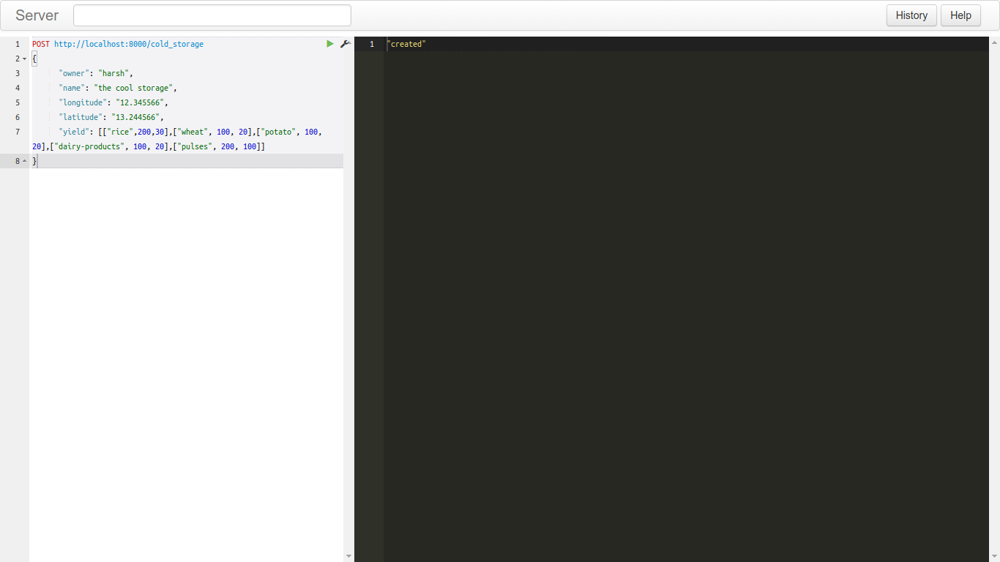

# django-foodsec

>api is at [food-security.herokuapp.com](food-security.herokuapp.com)

## signup

## login

## yield_of_different_products_is_now_passed_as_array

## cold_storage_person_enters_the_details_of_storage

